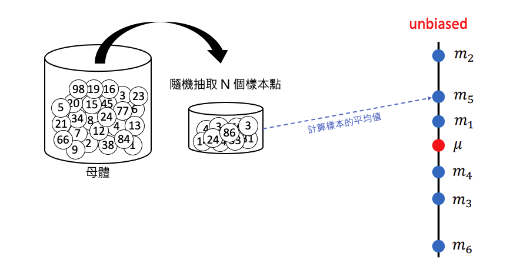
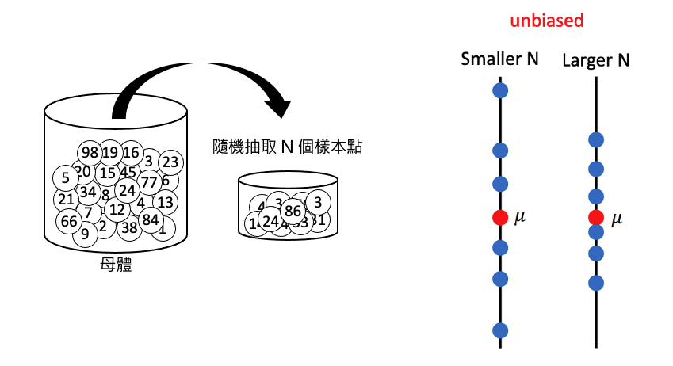
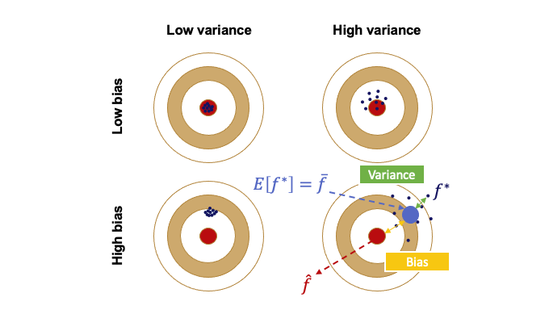

# ML Lecture 2: Where does the error come from?

## 誤差的主要來源
在機器學習中，誤差（Error）主要來自兩個來源：

1. **Variance（變異）**
2. **Bias（偏差）**

了解這兩種誤差的來源有助於我們釐清模型預測不佳的原因，並有助於設計更精準的機器學習模型。接下來，我們將從統計的角度深入探討這兩種誤差來源。

## 機器學習模型
假設我們有一個真實的環境，其真實函數為 $\hat{f}$。我們可以透過從這個環境中收集資料，並訓練一個模型，得到對 $\hat{f}$ 的估計函數 $f^{*}$。$f^{*}$ 與 $\hat{f}$ 之間的差異，主要來源於**偏差（Bias）**和**變異（Variance）**。

!!! note

        $\hat{f}$ 代表真實的函數(即標準答案，例如真實系統)，而 $f^{*}$ 是模型學習後所得到的最佳估計函數。$f^{*}$ 與 $\hat{f}$ 之間的誤差可能來自偏差（Bias）或變異（Variance）。

## 估測隨機變數的平均值與變異數
舉個機率統計的例子，假設我們有一個隨機變數 $x$，其真實平均值為 $\mu$。為了估計這個平均值，我們從母體中隨機抽取 $N$ 個樣本點，並計算這些樣本的平均值 $\bar{m}$。由於我們進行的是抽樣，因此樣本平均值 $\bar{m}$ 並不一定等於真實平均值 $\mu$。

### 估測平均值
如果我們多次重複這個抽樣過程，每次抽取 $N$ 個樣本並計算平均值，可能會得到不同的樣本平均值。例如，進行六次實驗後，得到的樣本平均值分別為 $m_1, m_2, m_3, m_4, m_5,$ 和 $m_6$。這些樣本平均值與真實平均值 $\mu$ 的接近程度會有所不同，這種變動的原因主要來自於偏差（Bias）和變異（Variance）。

如附圖所示，當我們多次進行抽樣並計算樣本平均值後，可以發現樣本平均值的期望 $\mathbb{E}[\bar{m}]$ 會趨近於真實平均值 $\mu$。這意味著，雖然單次抽樣結果可能與 $\mu$ 有所差距，但透過多次抽樣得到的平均值 $\bar{m}$ 是無偏的估計。

公式上可以表示為：

$$
\mathbb{E}[\bar{m}] = \mathbb{E} \left[ \frac{1}{N} \sum_{n=1}^{N} x^n \right] = \frac{1}{N} \sum_{n=1}^{N} \mathbb{E}[x^n] = \mu
$$

因此，透過多次實驗與抽樣計算，我們可以得到一個接近母體真實平均值的估計結果，這也是統計學中所謂的「無偏估計」的概念。

!!! note

        每個樣本平均值 $\bar{m}$ 不一定等於真實平均值 $\mu$，但若我們取多個 $\bar{m}$ 的期望值，最終會趨近於 $\mu$。這種情況類似於打靶時，子彈雖然分佈在靶心周圍，但不會全部命中靶心。子彈散佈的範圍取決於變異（Variance），反映了樣本平均值的波動程度。

由於各次採樣得到的平均數是散開的，我們可以透過計算平均數的變異數，觀察出採樣次數與平均值分散程度的關係。

$$
\text{Var}[\bar{m}] = \frac{\sigma^2}{N}
$$
 
 其中 $\sigma^2$ 是隨機變數 $x$ 的真實變異數，而 $N$ 是抽樣的樣本數。當我們取較多樣本數 $N$ 時，變異會隨之減少，因此樣本平均值的分佈會更集中在真實平均值 $\mu$ 附近；反之，當樣本數 $N$ 較少時，變異較大，樣本平均值的分佈範圍也會較為分散。這說明了樣本數量對變異的影響——抽樣越多次，估計結果越穩定，越接近於無偏的真實值 $\mu$。

### 估測變異數
首先，我們可以使用前述方法估計出母體的平均值 $\mu$，接著將這個估計值代入下列公式來計算樣本變異數 $s^2$：

$$
s^2 = \frac{1}{N} \sum_{n=1}^{N} (x^n - m)^2
$$

然而，使用各組樣本計算得到的 $s^2$ 並不一定等於真正的母體變異數 $\sigma^2$。即便我們對這些樣本變異數 $s^2$ 取期望值，其結果仍然帶有偏差（Bias），無法完全等於 $\sigma^2$。如附圖所示，當取期望值後，$s^2$ 的估計結果與真實的 $\sigma^2$ 之間存在系統性的偏差。

這種偏差使得樣本變異數 $s^2$ 往往略小於母體的變異數 $\sigma^2$，雖然有時也可能因樣本的波動而略高於 $\sigma^2$。實際上，這種偏差可透過調整公式來減少，使樣本變異數的估計更加接近 $\sigma^2$。當樣本數 $N$ 趨於無限大時，樣本變異數 $s^2$ 的期望值將逐漸趨近於真正的 $\sigma^2$，即樣本變異數的估計會隨著樣本數的增加而越趨精確。

## 以射標靶為例，說明誤差產生的原因
誤差的來源可以分為兩個方面：

1. **瞄準的準確性（Bias）**：指的是瞄準時的偏移程度，代表模型的平均預測值與目標值之間的距離。如果偏移過大，表示模型的 Bias 很高。
2. **散佈的範圍（Variance）**：即便瞄準在一個特定位置，但每次射擊的結果仍會有一定的偏移。這些偏移分佈的廣度反映了模型的 Variance。

在附圖中可以看到不同組合的 Bias 和 Variance 所導致的效果：

- **左上角（低 Bias, 低 Variance）**：這是理想狀況，模型既準確又穩定。每個點都集中在靶心附近，誤差很小。
- **右上角（低 Bias, 高 Variance）**：這個情況下，模型的瞄準位置準確（低 Bias），但每次的結果散佈較大（高 Variance）。造成誤差的主因在於 Variance，導致樣本點分佈較分散。
- **左下角（高 Bias, 低 Variance）**：在此情況中，模型的瞄準位置出現較大偏移（高 Bias），但結果相對穩定（低 Variance），即所有點集中在同一處，但整體位置偏離靶心，形成較大誤差。
- **右下角（高 Bias, 高 Variance）**：這是最不理想的狀況，模型既偏離靶心（高 Bias），又散佈較大（高 Variance），每次的結果都偏離目標，且分佈不穩定。

每個點代表一次模型訓練的結果，也可以理解為一條迴歸線的「表現」。若模型的誤差過大，它的預測結果將偏離靶心（真實值）。透過理解 Bias 和 Variance 的組合影響，我們可以更有效地調整模型以降低誤差，使模型表現更接近靶心。

!!! note

        - **欠擬合 Underfitting**: 過於簡單的模型使得預測結果彈性不高，訓練集與測試集表現都不好。low variance (high bias)。
        - **過擬合 Overfitting**: 過於複雜的模型使得訓練集完整的被擬合，因此訓練集表現極好，但測試集表現不佳。high variance (low bias)。

