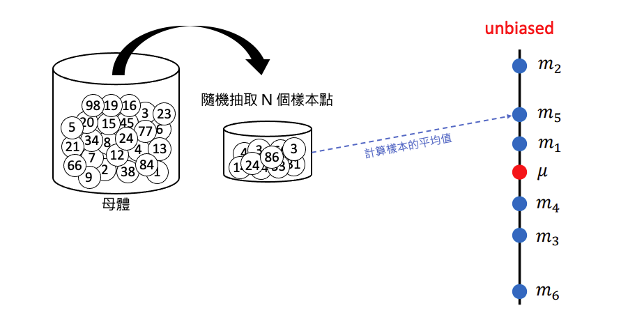

# ML Lecture 2: Where does the error come from?

## 誤差的主要來源
在機器學習中，誤差（Error）主要來自兩個來源：

1. **Variance（變異）**
2. **Bias（偏差）**

了解這兩種誤差的來源有助於我們釐清模型預測不佳的原因，並有助於設計更精準的機器學習模型。接下來，我們將從統計的角度深入探討這兩種誤差來源。

## 機器學習模型
假設我們有一個真實的環境，其真實函數為 $\hat{f}$。我們可以透過從這個環境中收集資料，並訓練一個模型，得到對 $\hat{f}$ 的估計函數 $f^{*}$。$f^{*}$ 與 $\hat{f}$ 之間的差異，主要來源於**偏差（Bias）**和**變異（Variance）**。

!!! note

    $\hat{f}$ 代表真實的函數(即標準答案，例如真實系統)，而 $f^{*}$ 是模型學習後所得到的最佳估計函數。$f^{*}$ 與 $\hat{f}$ 之間的誤差可能來自偏差（Bias）或變異（Variance）。

## 估測隨機變數的平均值與變異數
舉個機率統計的例子，假設我們有一個隨機變數 $x$，其真實平均值為 $\mu$。為了估計這個平均值，我們從母體中隨機抽取 $N$ 個樣本點，並計算這些樣本的平均值 $\bar{m}$。由於我們進行的是抽樣，因此樣本平均值 $\bar{m}$ 並不一定等於真實平均值 $\mu$。

### 估測平均值
如果我們多次重複這個抽樣過程，每次抽取 $N$ 個樣本並計算平均值，可能會得到不同的樣本平均值。例如，進行六次實驗後，得到的樣本平均值分別為 $m_1, m_2, m_3, m_4, m_5,$ 和 $m_6$。這些樣本平均值與真實平均值 $\mu$ 的接近程度會有所不同，這種變動的原因主要來自於偏差（Bias）和變異（Variance）。

如附圖所示，當我們多次進行抽樣並計算樣本平均值後，可以發現樣本平均值的期望 $\mathbb{E}[\bar{m}]$ 會趨近於真實平均值 $\mu$。這意味著，雖然單次抽樣結果可能與 $\mu$ 有所差距，但透過多次抽樣得到的平均值 $\bar{m}$ 是無偏的估計。

公式上可以表示為：

$$
\mathbb{E}[\bar{m}] = \mathbb{E} \left[ \frac{1}{N} \sum_{n=1}^{N} x^n \right] = \frac{1}{N} \sum_{n=1}^{N} \mathbb{E}[x^n] = \mu
$$

因此，透過多次實驗與抽樣計算，我們可以得到一個接近母體真實平均值的估計結果，這也是統計學中所謂的「無偏估計」的概念。

!!! note

    每個樣本平均值 $\bar{m}$ 不一定等於真實平均值 $\mu$，但若我們取多個 $\bar{m}$ 的期望值，最終會趨近於 $\mu$。這種情況類似於打靶時，子彈雖然分佈在靶心周圍，但不會全部命中靶心。子彈散佈的範圍取決於變異（Variance），反映了樣本平均值的波動程度。

由於各次採樣得到的平均數是散開的，我們可以透過計算平均數的變異數，觀察出採樣次數與平均值分散程度的關係。

$$
\text{Var}[\bar{m}] = \frac{\sigma^2}{N}
$$
 
 其中 $\sigma^2$ 是隨機變數 $x$ 的真實變異數，而 $N$ 是抽樣的樣本數。當我們取較多樣本數 $N$ 時，變異會隨之減少，因此樣本平均值的分佈會更集中在真實平均值 $\mu$ 附近；反之，當樣本數 $N$ 較少時，變異較大，樣本平均值的分佈範圍也會較為分散。這說明了樣本數量對變異的影響——抽樣越多次，估計結果越穩定，越接近於無偏的真實值 $\mu$。

### 估測變異數
首先，我們可以使用前述方法估計出母體的平均值 $\mu$，接著將這個估計值代入下列公式來計算樣本變異數 $s^2$：

$$
s^2 = \frac{1}{N} \sum_{n=1}^{N} (x^n - m)^2
$$

我們一樣可以進行六次實驗，得到六組不同的 $s^2$。米嗯可以發現，使用各組樣本計算得到的 $s^2$ 並不一定等於真正的母體變異數 $\sigma^2$。即便我們對這些樣本變異數 $s^2$ 取期望值，其結果仍然帶有偏差（Bias），無法完全等於 $\sigma^2$。如附圖所示，當取期望值後，$s^2$ 的估計結果與真實的 $\sigma^2$ 之間存在系統性的偏差。

這種偏差使得樣本變異數 $s^2$ 往往略小於母體的變異數 $\sigma^2$，雖然有時也可能因樣本的波動而略高於 $\sigma^2$。實際上，這種偏差可透過調整公式來減少，使樣本變異數的估計更加接近 $\sigma^2$。當樣本數 $N$ 趨於無限大時，樣本變異數 $s^2$ 的期望值將逐漸趨近於真正的 $\sigma^2$，即樣本變異數的估計會隨著樣本數的增加而越趨精確。

## 以射標靶為例，說明誤差產生的原因
誤差的來源可以分為兩個方面：

1. **瞄準的準確性（Bias）**：指的是瞄準時的偏移程度，代表模型的平均預測值與目標值之間的距離。如果偏移過大，表示模型的 Bias 很高。
2. **散佈的範圍（Variance）**：即便瞄準在一個特定位置，但每次射擊的結果仍會有一定的偏移。這些偏移分佈的廣度反映了模型的 Variance。

在附圖中可以看到不同組合的 Bias 和 Variance 所導致的效果：

- **左上角（低 Bias, 低 Variance）**：這是理想狀況，模型既準確又穩定。每個點都集中在靶心附近，誤差很小。
- **右上角（低 Bias, 高 Variance）**：這個情況下，模型的瞄準位置準確（低 Bias），但每次的結果散佈較大（高 Variance）。造成誤差的主因在於 Variance，導致樣本點分佈較分散。
- **左下角（高 Bias, 低 Variance）**：在此情況中，模型的瞄準位置出現較大偏移（高 Bias），但結果相對穩定（低 Variance），即所有點集中在同一處，但整體位置偏離靶心，形成較大誤差。
- **右下角（高 Bias, 高 Variance）**：這是最不理想的狀況，模型既偏離靶心（高 Bias），又散佈較大（高 Variance），每次的結果都偏離目標，且分佈不穩定。

??? tip "補充說明（稍後會提到）"

    依據每種情況的需求，選擇合適的方法可以更有效地降低模型的誤差並提升預測表現。總結來說，解決不同組合情況的方法如下：

    - **低 Bias, 高 Variance**：增加訓練數據、簡化模型結構、正則化、交叉驗證。
    - **高 Bias, 低 Variance**：增加模型複雜度、特徵工程、減少正則化。
    - **高 Bias, 高 Variance**：重新設計模型、增加訓練數據、特徵工程、調整正則化。

每個點代表一次模型訓練的結果，也可以理解為一條迴歸線的「表現」。若模型的誤差過大，它的預測結果將偏離靶心（真實值）。透過理解 Bias 和 Variance 的組合影響，我們可以更有效地調整模型以降低誤差，使模型表現更接近靶心。

## 比較簡單和複雜模型的差別
事實上，即使是相同的模型，使用不同的訓練資料所產生的結果也可能有所不同。接下來，我們將以「線條」的方式來觀察，當「對相同模型使用不同的訓練資料」時，所產生結果的特性是如何變化的。

### 觀察Variance
當使用簡單模型時，即使訓練資料有所變動，模型的預測結果也不會有太大的影響。這是因為簡單模型結構穩定，對訓練數據的依賴程度較低，因此不同樣本集帶來的結果差異較小，變異（Variance）也較小(如下左圖)。

然而，當使用複雜模型時，不同的訓練資料會對模型結果產生較大影響(如下右圖)。複雜模型因具備更高的靈活性，能夠擬合數據的細微變化，但這也使得其在不同訓練樣本上表現出較大的波動，Variance 更高。

因此，簡單模型較不受 Variance 影響，能夠提供穩定的預測；而複雜模型雖然擁有更高的擬合能力，但在不同訓練數據下容易出現不穩定，對 Variance 的敏感度較高。正如附圖所示，簡單模型在多組訓練資料下的預測結果一致性較高，而複雜模型則顯示出明顯的波動。

!!! note

    - 當使用簡單模型時，不同訓練資料對模型的影響較小
    - 當使用複雜模型時，則會因訓練資料的不同產生較大的影響。

### 觀察Bias
接下來我們來探討 Bias。在下圖中，黑線代表真實資料的分佈，所有資料點皆來自這條曲線；紅線表示經過 5000 次取樣後，不同模型的訓練結果；而藍線則為這 5000 個模型結果的平均值。

從圖中我們可以觀察到以下現象：

- **簡單模型**（左圖）的平均結果離真實資料的黑線較遠，顯示出偏差（Bias）較大，這意味著簡單模型難以捕捉真實資料的特徵。
- **複雜模型**（右圖）的預測雖然看起來雜亂，但多個模型的平均結果（藍線）非常接近真實資料的黑線，表示複雜模型對 Bias 的影響較小，能夠更精準地擬合真實資料。

!!! note

    **結論**：簡單模型因 Bias 產生的誤差較大；而複雜模型對 Bias 的影響較小，因此產生的誤差也較低。

    為什麼會出現這樣的現象呢？從圖中下方的靶可以觀察到：

    - **簡單模型**的特徵較為有限，因此即便找到誤差最小的結果，模型的平均預測值仍會與靶心（真實值）有一定距離，導致 Bias 較大。
    - **複雜模型**在設計上包含了靶心的可能性，雖然它的結果較為分散（高 Variance），且難以找到唯一最佳解，但透過多次取樣後的平均值會逐漸靠近靶心，使得 Bias 較小。

    因此，簡單模型偏向於穩定但偏離真實值，而複雜模型則雖有較大的波動性，但在多次取樣下可以更接近真實值。

## Overfitting 與 Underfitting
圖中的藍線代表模型複雜度與誤差之間的關係，表示隨著模型複雜度的增加，誤差的變化趨勢。這條線是由紅線和綠線共同作用形成的，其中：

- **紅線**表示由 Bias 所產生的誤差，隨著模型複雜度的增加，Bias 逐漸減少。
- **綠線**表示由 Variance 所產生的誤差，隨著模型複雜度的增加，Variance 則逐漸增大。

在紅線和綠線交叉的區域，可以達到較低的總誤差，這就是模型的最佳平衡點。當模型的複雜度過低時，誤差主要來自於 Bias，此時模型無法充分擬合數據，稱為 **Underfitting**。相反地，當模型的複雜度過高時，誤差主要來自於 Variance，此時模型過度擬合訓練數據，稱為 **Overfitting**。

!!! note

    - **欠擬合 Underfitting**: 過於簡單的模型使得預測結果彈性不高，訓練集與測試集表現都不好。(高 Bias, 低 Variance)。
    - **過擬合 Overfitting**: 過於複雜的模型使得訓練集完整的被擬合，因此訓練集表現極好，但測試集表現不佳。(低 Bias, 高 Variance)。

!!! Abstract "延伸閱讀"

    - [機器學習 - 不能忽視的過擬合與欠擬合](https://andy6804tw.github.io/crazyai-ml/24.不能忽視的過擬合與欠擬合/)

## 如何判斷bias大還是variance大？

### Bias 過大
如果模型的 Bias 過大，表示模型無法擬合訓練資料，即使不斷調整，也難以降低 Training Loss（Error）。這通常意味著模型的結構太簡單，未能包含真實答案，因此即便增加再多的訓練資料，Training Loss 仍然無法降低。

- **現象**：訓練資料的誤差（Training Loss）很大。
- **原因**：模型的假設過於簡單，無法捕捉資料的真實模式。
- **解決方式**：通常需要重新設計模型。可以考慮增加模型的複雜度（例如，從一次式變成二次式），或引入更多特徵，使模型更接近資料的真實分佈。

!!! note

    在這種情況下，增加訓練資料無法改善模型表現，因為問題出在模型結構本身不具備包含正確答案的能力。

### Variance 過大
若訓練完模型後，發現 Training Loss 很小但 Testing Error 很大，這表明模型的 Variance 過大。模型可能過度擬合訓練資料，即使在訓練資料上表現良好，但在測試資料上則表現不佳。

- **現象**：訓練資料誤差很小，而測試資料誤差很大。
- **原因**：模型過度擬合訓練資料，捕捉了許多不必要的細節（例如，雜訊），導致測試資料的預測結果不穩定。
- **解決方式**：

1.**增加更多訓練資料**：增大資料量有助於平衡模型，使其更具泛化能力，從而減少無效區域。舉例來說，如果原先模型只使用少量樣本訓練（如 10 筆），可以將樣本量增加到 100 筆。這樣一來，模型會更穩定，Variance 也會降低。
    
!!! note

    現實中，獲取更多資料可能不易，因此可以考慮利用數據增強技術來生成更多資料。例如：

    - **圖像辨識**：可將圖像稍微傾斜角度或是翻轉，增加樣本量。
    - **語音辨識**：若女性聲音樣本不足，可將男性聲音的音高調高來模擬女性聲音。
    - **瑕疵樣本**：透過生成式AI技術模擬產生更多的瑕疵樣本。

2.**簡化模型結構**：考慮減少模型的複雜度，像是降低神經網絡的層數或節點數，這可以減少模型的靈活性，降低 Variance，並使模型更具泛化能力。  

3.**正則化（Regularization）**：簡單來說就是避免模型太複雜，可以在 Loss Function 中加入正則化項，限制模型的過度擬合。正則化會讓模型變得更平滑，減少無效區域的出現，從而降低 Variance。以下是有無使用正則化的對比圖：

!!! note

    雖然正則化可以減少 Variance，但也可能會稍微增加 Bias，因為模型被限制後，可能無法完全擬合某些複雜模式。

4.**交叉驗證（Cross-Validation）**：使用交叉驗證可以更好地評估模型的泛化能力。在交叉驗證中，數據集被分為多個子集，模型輪流在不同的子集上進行訓練和測試。這種方法可以減少模型對單一訓練集的依賴，有助於檢測和防止過度擬合，並確保降低 Variance。

## 如何挑選合適模型？
在設計模型時，往往可以選擇多種模型架構與參數組合。在選擇模型時，應該考量 **Bias** 與 **Variance**，希望在這兩者之間取得平衡，最終讓模型在 Testing Data 上達到最低的誤差。

### 錯誤示範：僅依賴手上的 Testing Set
如果你也是這麼做的，請看完這篇文章後務必改變做法！錯誤的方式是：假設已訓練了三種模型 Model 1、Model 2、Model 3，僅根據手上 Testing Set（Public Testing Set）上的最小誤差來選擇最終模型。然而，這個 Testing Set 只是我們手上測試資料的一部分，並不代表真正的 Testing Set（Private Testing Set）。

僅依賴 Public Testing Set 選擇模型，會產生偏誤，因為我們看不到 Private Testing Set 的結果，無法確保模型的泛化能力。在 Kaggle 競賽中，Public Leaderboard 顯示的結果僅基於部分測試資料，因此即使在 Public Testing Set 上表現良好，也不保證在 Private Testing Set 上有同樣的表現。

### 為什麼 Public Set 的結果不可靠？
這裡舉個例子，在 Kaggle 競賽中，Public Testing Set 只是測試資料的一部分，模型可能會過度擬合 Public Testing Set，導致在 Private Testing Set 上的表現不佳。這就是為什麼僅憑 Public Leaderboard 的排名來選擇模型是不可靠的，因為最終 Private Leaderboard 才是最終的評估標準。

### 正確做法：如何可靠地選擇模型？
為了提升模型在未知測試資料上的泛化能力，可以採取以下方法：

1. **交叉驗證（Cross-Validation）**：將訓練資料分成多個子集，進行交叉驗證，觀察模型在不同子集上的表現，以便獲得更穩定的評估結果。
   
2. **K 折交叉驗證（K-fold Cross Validation）**：將訓練資料劃分為 K 個子集，每次使用其中一個子集作為驗證集，其餘 K-1 個子集作為訓練集。重複 K 次，以確保每個子集都被用作驗證集一次，最終取所有結果的平均值，獲得更穩定且可靠的評估。

#### 交叉驗證（Cross-Validation）
首先，將原本的 Training Set 分成兩部分：Training Set 和 Validation Set。在訓練過程中，只使用分出來的 Training Set 來訓練模型，訓練完後，再用 Validation Set 評估模型的表現。透過 Validation Set 的結果，可以挑選出一個表現較佳的模型。

接著，將分開的兩個資料集合併回成完整的 Training Set，並用這個完整的 Training Set 在選出的最佳模型上再訓練一次，如此可以充分利用所有的訓練資料，而不必擔心訓練資料量減少會影響模型的表現。

這樣做的好處 如附圖所示，我們已經透過 Validation Set 找到最佳模型。然而，這個模型在 Testing Set 上的誤差可能比在 Validation Set 上的誤差更大。這樣的誤差變化正好反映出，模型在使用未見過的資料（如 Testing Set 或實際應用中的新數據）時，可能的真實誤差。這樣的驗證方式可以幫助我們挑選出更具泛化能力的模型，提升模型在未知數據上的表現。

!!! note

    你可能會擔心，分出來的 Validation Set 也可能帶有偏差（bias），導致模型在這部分資料上出現過擬合的情況。因此，可以考慮進行 K 次交叉驗證來減少這種偏誤的影響。

### K 折交叉驗證（K-fold Cross Validation）
如果擔心分出來的 Validation Set 含有偏誤（bias），可以使用 K 折交叉驗證來減少這種情況的影響。以下以 3 折交叉驗證（3-fold Cross Validation）為例說明：

在訓練前，先將資料集分成三等份，每次選擇其中兩份作為 Training Set，另一份作為 Validation Set。每次訓練後，使用該次的 Validation Set 評估模型的表現，並記錄誤差。完成 3 次驗證後，取各次得到的誤差平均值，選擇平均誤差最低的模型。

接著，將所有的 Training Set 資料合併為一個完整的集合，並用這個集合重新訓練選出的最佳模型。最後，使用 Public Testing Set 進行模型評估，得到的誤差應該會較為接近在 Private Set 中的真實誤差。

!!! Abstract "延伸閱讀"

    - [交叉驗證 Cross-Validation 簡介](https://andy6804tw.github.io/crazyai-ml/25.交叉驗證%20Cross-Validation%20簡介/)
    - [交叉驗證 K-Fold Cross-Validation](https://andy6804tw.github.io/crazyai-ml/26.交叉驗證%20K-Fold%20Cross-Validation/)
    - [How to Select Your Final Models in a Kaggle Competition](https://www.chioka.in/how-to-select-your-final-models-in-a-kaggle-competitio/)