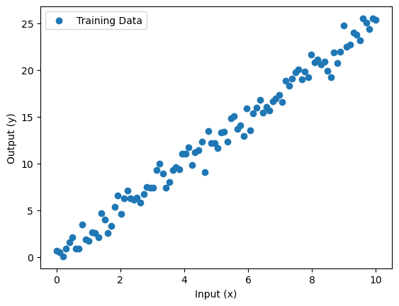

# 深度神經網路（DNN）迴歸基礎教學

範例程式：[](https://colab.research.google.com/github/andy6804tw/crazyai-dl/blob/main/code/tensorflow/DNN%20Regression.ipynb)

在這份教學中，我們將介紹如何使用 TensorFlow 來建構一個基礎的深度神經網路（DNN）進行迴歸分析。迴歸問題是機器學習中的一種重要任務，主要用於預測連續數值，例如房價預測、汽車油耗等。在這裡，我們將一步步地帶領你學習如何從資料處理、模型構建到模型訓練，逐步掌握 DNN 迴歸的核心概念。

## 1. 載入套件

首先，我們匯入必要的套件：

```py
import tensorflow as tf
import numpy as np
import pandas as pd
import matplotlib.pyplot as plt
```

## 2. 資料準備
為了進行迴歸分析，我們需要一組訓練數據。在這裡，我們將使用一個簡單的合成數據集，模擬一個線性關係。這段程式創建了一組具有隨機雜訊的線性數據，並使用 Matplotlib 繪製出來，讓我們可以直觀地看到輸入與輸出之間的關係。

```py
# 產生簡單的線性數據
def generate_data():
    x = np.linspace(0, 10, 100)
    y = 2.5 * x + np.random.normal(0, 1, size=x.shape)
    return x, y

x_train, y_train = generate_data()

# 視覺化數據
plt.scatter(x_train, y_train, label='Training Data')
plt.xlabel('Input (x)')
plt.ylabel('Output (y)')
plt.legend()
plt.show()
```



## 3. 建構 DNN 模型
接下來，我們來建構一個簡單的深度神經網路模型。這個模型將包含幾個全連接層，用於擬合我們的數據。在這裡，我們使用了 `tf.keras.Sequential` 來建立模型，包含一層隱藏層，有 8 個神經元，並使用線性 linear 作為激發函數。輸出層有一個神經元，用於預測目標值。模型的損失函數為均方誤差（MSE），優化器則使用 Adam 來加速訓練。

```py
# 建構 DNN 模型
model = tf.keras.Sequential([
    tf.keras.layers.InputLayer(input_shape=(1,)),
    tf.keras.layers.Dense(8, activation='linear'),
    tf.keras.layers.Dense(1)
])

# 編譯模型
model.compile(optimizer='adam', loss='mse', metrics=['mae'])
```


## 4. 模型訓練
我們已經建構了模型，接下來我們將模型與數據進行訓練。這段程式將模型訓練 100 個 epoch，每次使用 10 個數據進行更新。通過調整 epoch 和 batch_size 的值，我們可以控制模型訓練的速度和效果。

```py
# 訓練模型
model.fit(x_train, y_train, epochs=100, batch_size=10, verbose=1)
```


## 5. 模型評估與預測
訓練完模型後，我們可以使用它來進行預測，並評估模型的效果。這段程式碼首先評估了模型在訓練數據上的表現，並使用訓練好的模型對新數據進行預測。最後，我們用圖表展示訓練數據和模型的預測結果。


```py
# 評估模型效果
loss, mae = model.evaluate(x_train, y_train)
print(f'模型損失（MSE）：{loss}, 平均絕對誤差（MAE）：{mae}')

# 進行預測
x_test = np.linspace(0, 10, 100)
y_pred = model.predict(x_test)

# 繪製預測結果
plt.scatter(x_train, y_train, label='Training Data')
plt.plot(x_test, y_pred, color='red', label='Model predict')
plt.xlabel('Input (x)')
plt.ylabel('Output (y)')
plt.legend()
plt.show()
```

## 6. 模型保存與輸出
最後，我們可以將訓練好的模型保存起來，以便日後使用或部署。這段程式將模型保存為 HDF5 格式的檔案，讓我們可以在需要時載入模型進行預測或重新訓練。

```py
# 保存模型
model.save('dnn_regression_model.h5')
print('模型已成功保存至 dnn_regression_model.h5')
```

!!! info

    TensorFlow 提供多種方法來儲存模型，以下是幾種常見的模型儲存方式：

    - **HDF5 格式（.h5 文件）**：適合在開發過程中使用，尤其是在多次迭代、快速測試模型或需要保存和重新載入模型進行訓練時。
    - **SavedModel 格式**：適合於模型部署與生產環境中使用。

    延伸閱讀： [Tensorflow Keras 模型儲存](https://andy6804tw.github.io/2021/03/29/tensorflow-save-model/)


在保存模型之後，我們可以重新載入它並進行推論。這段程式首先重新載入保存的模型，接著對新的輸入值 x = 5.0 進行推論，並輸出預測結果。

```py
# 載入模型並進行推論
loaded_model = tf.keras.models.load_model('dnn_regression_model.h5')
print('模型已成功載入')

# 使用載入的模型進行推論
x_new = np.array([5.0])
y_new_pred = loaded_model.predict(x_new)
print(f'當 x = 5.0 時，模型預測的 y 值為：{y_new_pred[0][0]}')
```

!!! note

        除了使用 TensorFlow 內建的格式保存模型外，當模型訓練完成並準備正式部署於產品中時，也可以使用 ONNX（Open Neural Network Exchange）格式。ONNX 是一種開放格式，支持在不同深度學習框架之間進行模型轉換，使得模型可以通過 ONNX Runtime 在多種平台上執行，提高部署的靈活性。

## 結論
在本教學中，我們學會了如何使用 TensorFlow 構建一個簡單的深度神經網路來進行迴歸預測。我們從資料準備開始，一直到模型建構、訓練和評估，完整地了解了整個過程。接下來，你可以嘗試使用其他不同的資料集或改變模型結構，來進一步提高模型的準確度和效果。