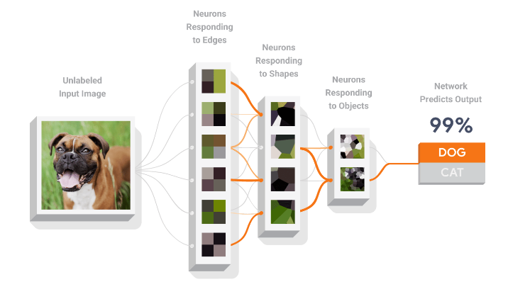
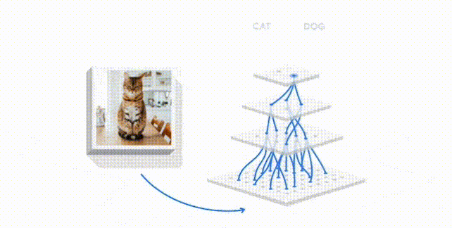

# TensorFlow 101 從零開始：起源與入門指南

## 系列的起源與「101」的含義

「TensorFlow 101 從零開始」這個教學系列的初衷是幫助那些對機器學習（Machine Learning）充滿好奇、想要了解其原理與實際應用的人，特別是那些完全沒有相關背景的初學者。我們希望透過這個系列，以簡單易懂的方式帶領你走進深度學習的世界，理解 TensorFlow 的強大之處，並在實踐中感受到人工智慧的魅力。

「101」這個代號經常出現在大學基礎課程的名稱中，象徵著從最基礎、最簡單的部分開始。因此，「TensorFlow 101 從零開始」意指我們將帶你從入門開始，逐步掌握 TensorFlow 和機器學習的基礎知識，進而建立完整的概念架構。

## 為什麼選擇 TensorFlow？

TensorFlow 是由 Google 釋出的開源機器學習框架，是目前世界上最流行的深度學習工具之一。它的優勢在於強大的社群支持、豐富的開發工具，以及靈活的擴展能力，不論你是想要建立簡單的模型還是進行複雜的研究，TensorFlow 都能滿足你的需求。TensorFlow 不僅可以幫助研究者探索新技術，也能幫助開發者將 AI 技術整合到實際應用中。

### TensorFlow 的主要優勢

1. **強大的社群支持與資源**：TensorFlow 是一個由 Google 釋出的開源專案，擁有龐大的社群支持。這意味著你可以很容易找到教學資源、問答論壇，甚至是解決問題的現有程式碼範例。

2. **多平台支持**：TensorFlow 支持多種平台，包括雲端、桌面、行動裝置等。這讓你可以在不同的硬體上進行機器學習模型的訓練與部署，從而提升應用的靈活性。

3. **豐富的工具與 API**：TensorFlow 提供了易於使用的高層 API，例如 Keras，這使得新手也可以輕鬆上手，同時也提供底層的控制接口，讓進階使用者能夠調整細節，達到最佳效果。

## 機器學習簡介

機器學習是人工智慧的一個子領域，它主要關注於如何讓計算機從數據中學習，而不需要明確地編寫規則。簡單來說，機器學習的目標就是利用數據來訓練模型，使其能夠對新的、未見過的數據做出準確的預測或判斷。這種能力讓我們可以解決許多傳統程式設計難以處理的問題，例如圖像分類、語音識別等。

**常見的機器學習問題類型**

1. **迴歸問題**：預測一個連續的數值，例如房價預測。
2. **分類問題**：將資料分成不同的類別，例如垃圾郵件過濾。
3. **群集問題**：將相似的資料點分組，例如客戶分群。

## 解決機器學習問題的步驟

在機器學習中，解決一個問題通常包含以下幾個步驟：

1. **定義問題**：首先，我們需要了解要解決的問題，明確目標，例如預測房價或分類圖片。

2. **收集並準備數據**：收集足夠的數據來訓練模型，並進行必要的清洗和預處理，例如標準化或正規化數據。

3. **選擇模型**：根據問題類型選擇適當的模型，例如線性迴歸、神經網路等。

4. **訓練模型**：利用訓練數據對模型進行訓練，讓模型學習如何對新數據做出正確預測。

5. **評估模型**：在測試數據集上評估模型的性能，檢驗它的準確性和泛化能力。

6. **優化與部署**：如果模型表現不佳，可以通過調整參數進行優化，最後將模型部署到實際的應用中。

## 使用 TensorFlow 訓練類神經網路
TensorFlow 提供了一個強大的框架來構建和訓練神經網路，從簡單的全連接層到複雜的深度神經網路，TensorFlow 都能應付自如。下面簡單介紹如何使用 TensorFlow 訓練類神經網路的基本流程。

1. **建立模型**：在 TensorFlow 中，我們通常使用 `tf.keras.Sequential` 來構建模型。這種方式可以讓我們依序添加每一層，構建出神經網路。當然也提供更進階用法讓專業人士進行演算法開發。

2. **編譯模型**：在模型構建好之後，需要指定損失函數和優化器。損失函數用於衡量模型的預測結果與真實值之間的差距，而優化器則用於指導模型如何最小化損失。

3. **訓練模型**：利用訓練數據對模型進行多次迭代訓練，模型會不斷調整自身的參數，讓預測結果更接近真實值。

4. **評估模型**：在訓練完畢後，可以在測試數據上對模型進行評估，以衡量其在未見數據上的表現。

這系列將逐步帶領你從最基礎的概念開始，理解並掌握 TensorFlow 的基礎，最終幫助你自行構建自己的神經網路模型，解決各種有趣的問題。
