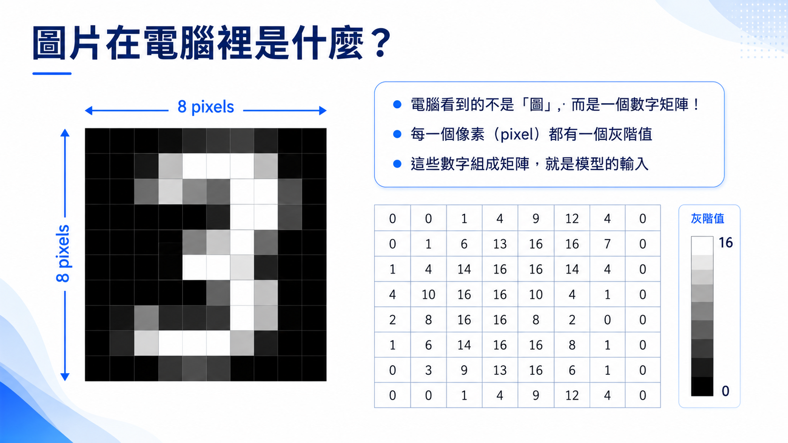
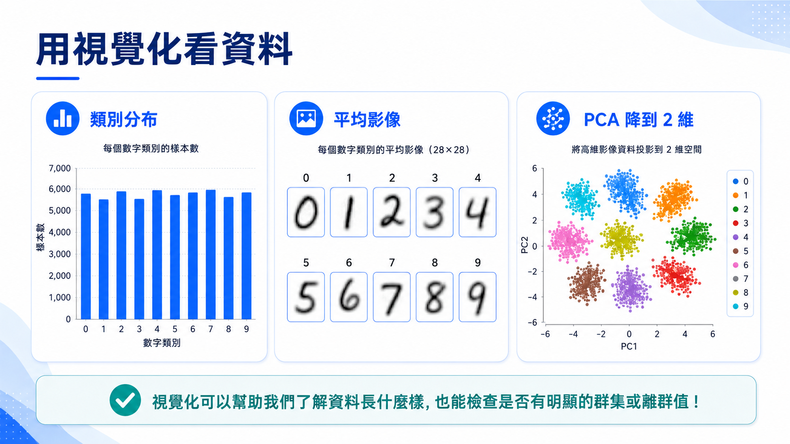
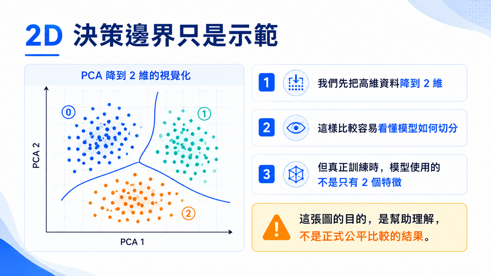

# 圖片資料與手寫數字辨識

範例程式：[](https://colab.research.google.com/github/andy6804tw/crazyai-dl/blob/main/code/tensorflow/neural-network-intro-hands-on/01_digits_data_visualization.ipynb)

在開始訓練模型之前，我們先從資料本身開始觀察。影像對人類來說是一張圖片，但對電腦來說，圖片其實是一組數字陣列。這份 notebook 的重點，是讓我們理解「模型吃進去的資料長什麼樣子」。


## 1. 認識 `load_digits` 資料集

本章使用 scikit-learn 內建的 `load_digits` 資料集。這是一個經典的手寫數字辨識資料集，資料內容來自 UCI Optical Recognition of Handwritten Digits dataset，常被用來示範影像分類與傳統機器學習模型。

每一筆資料是一張 8x8 的手寫數字灰階圖片，標籤為 0 到 9。

| 項目 | 說明 |
|---|---|
| 任務 | 手寫數字分類 |
| 類別 | 0 到 9，共 10 類 |
| 圖片大小 | 8x8 |
| 色彩 | 灰階 |
| 像素範圍 | 0 到 16 |
| 樣本數 | 1797 筆 |

!!! note

    這裡的像素值是 0 到 16，不是一般常見影像的 0 到 255。原因是 `load_digits` 是經過整理的低解析度資料集，每個像素以 4-bit 灰階強度表示，因此共有 17 個可能值：0、1、2，直到 16。

## 2. 圖片其實是陣列

一張 8x8 的灰階圖片，在電腦中可以表示成 8 列、8 欄的數字矩陣。數字越大，代表該位置越亮；數字越小，代表越接近黑色。



例如一張數字圖片可能長得像這樣：

```py
[[ 0.  0.  5. 13.  9.  1.  0.  0.]
 [ 0.  0. 13. 15. 10. 15.  5.  0.]
 [ 0.  3. 15.  2.  0. 11.  8.  0.]
 [ 0.  4. 12.  0.  0.  8.  8.  0.]
 [ 0.  5.  8.  0.  0.  9.  8.  0.]
 [ 0.  4. 11.  0.  1. 12.  7.  0.]
 [ 0.  2. 14.  5. 10. 12.  0.  0.]
 [ 0.  0.  6. 13. 10.  0.  0.  0.]]
```

這也是影像辨識任務的第一個重要觀念：模型並不是直接「看懂圖片」，而是接收一組數字，並從這些數字中學習分類規則。

## 3. Flatten：把圖片攤平成特徵向量

傳統機器學習模型通常期待輸入資料是一個一維特徵向量。因此 8x8 圖片常會被攤平成長度 64 的向量。

```py
# 原始圖片形狀
image.shape

# 攤平成一維向量
image.reshape(-1).shape
```

從模型角度來看，這 64 個數字就是 64 個特徵。每個特徵代表圖片中某一個像素位置的亮度。

## 4. 資料視覺化

在正式建立模型之前，先畫出部分圖片與標籤，可以幫助我們確認資料是否正確載入，也能觀察不同數字的外觀差異。

```py
import matplotlib.pyplot as plt

fig, axes = plt.subplots(2, 5, figsize=(10, 4))

for ax, image, label in zip(axes.ravel(), digits.images[:10], digits.target[:10]):
    ax.imshow(image, cmap='gray')
    ax.set_title(f'label: {label}')
    ax.axis('off')

plt.tight_layout()
plt.show()
```



## 5. 降維觀察資料分布

每張圖片原本有 64 個像素特徵，人類很難直接在 64 維空間中觀察資料分布。因此我們可以使用 PCA 或 t-SNE 將資料投影到二維平面，觀察不同數字是否自然形成群集。

這裡的降維不是為了讓模型一定變好，而是為了幫助我們理解資料結構。



!!! info

    PCA 比較適合快速觀察整體線性結構；t-SNE 比較適合觀察局部群集關係。t-SNE 的圖通常比較漂亮，但它主要是視覺化工具，不應直接把二維圖上的距離解讀成原始資料中的真實距離。

## 6. 小結

這一章我們先不急著訓練模型，而是先回答三個基本問題：

1. 圖片在電腦裡是什麼？
2. 灰階像素值代表什麼？
3. 為什麼模型需要把圖片轉成數字特徵？

接下來，我們會使用這些數字特徵建立第一個傳統機器學習模型：SVM 手寫數字分類器。
