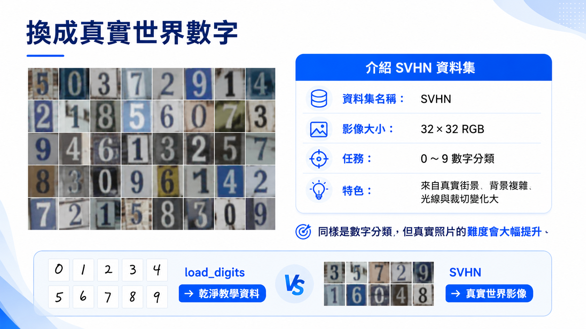

# 真實世界資料集：SVHN 街景門牌數字

範例程式：[](https://colab.research.google.com/github/andy6804tw/crazyai-dl/blob/main/code/tensorflow/neural-network-intro-hands-on/03_svhn_svm_baseline.ipynb)

前一章的 `load_digits` 是乾淨、低解析度、背景單純的手寫數字資料。這類資料很適合建立入門觀念，但它和真實世界影像仍有一段距離。

本章切換到 SVHN（Street View House Numbers）cropped 資料集。它同樣是 0 到 9 的數字分類任務，但圖片來自街景門牌，包含顏色、背景、光線、角度與周圍雜訊，更接近真實影像辨識問題。



## 1. 認識 SVHN cropped

SVHN 是由 Google Street View 影像中的門牌號碼整理而來的資料集，常用於數字辨識與影像分類研究。cropped 版本會將單一數字切成 32x32 的 RGB 圖片，任務是判斷圖片中的數字類別。

| 項目 | 說明 |
|---|---|
| 任務 | 街景門牌數字分類 |
| 類別 | 0 到 9，共 10 類 |
| 圖片大小 | 32x32 |
| 色彩 | RGB 彩色 |
| 原始特徵數 | 32 x 32 x 3 = 3072 |
| 資料特色 | 真實場景、背景複雜、光線與角度變化 |

!!! note

    SVHN 的資料來源與手寫數字不同。它不是乾淨的白底黑字圖片，而是從真實街景中擷取出來的數字，因此更能展現影像辨識任務的困難度。

## 2. 同樣是數字分類，為什麼變難？

人類看到 SVHN 圖片時，仍然可以靠視覺經驗判斷數字。但對模型來說，圖片只是 3072 個數字。若直接將彩色圖片攤平成一維向量，模型會失去很多空間結構資訊。

例如相鄰像素之間的關係、邊緣、筆畫方向、局部紋理，都是影像辨識的重要線索。傳統機器學習模型若只接收 raw pixels，通常需要額外的特徵工程，才能更有效利用這些資訊。

## 3. 使用 SVM 建立 SVHN baseline

為了和前面的手寫數字任務保持一致，本章仍使用 SVM RBF 作為 baseline。

流程如下：

1. 載入 SVHN cropped 資料。
2. 將 32x32 RGB 圖片攤平成 3072 維特徵。
3. 將像素值正規化到 0 到 1。
4. 使用 `StandardScaler` 對特徵標準化。
5. 使用 RBF kernel SVM 訓練分類模型。
6. 比較 train/test accuracy。

```py
model = Pipeline([
    ('scaler', StandardScaler()),
    ('svm', SVC(kernel='rbf', C=10, gamma='scale'))
])
```

## 4. 模型結果觀察

在目前 notebook 的設定下，SVHN 上的 SVM baseline 結果如下：

| 模型 | Train Accuracy | Test Accuracy |
|---|---:|---:|
| SVM RBF raw pixels | 0.6947 | 0.5170 |

這個結果可以看出，模型在訓練資料上已經學到一些規則，但在測試資料上的表現明顯下降。這代表 raw pixels 加上 SVM 對真實影像任務仍然有限。

## 5. 傳統機器學習與特徵工程

傳統機器學習方法通常很仰賴特徵工程。也就是說，模型表現不只取決於演算法，也取決於人類是否能設計出好的特徵。

在影像任務中，常見的人工特徵可能包含：

1. 邊緣方向。
2. 局部紋理。
3. 顏色統計。
4. 形狀描述。
5. HOG 等影像特徵。

如果特徵設計得好，傳統機器學習可以有不錯的表現；但當資料量大、影像變化多、任務複雜時，手工特徵工程會變得非常耗時，也不一定能涵蓋所有情況。

## 6. 小結

這一章的重點不是說 SVM 不好，而是看見模型與資料之間的關係。

在簡單手寫數字上，SVM 可以表現很好；但在 SVHN 這種真實影像資料上，直接使用 raw pixels 的傳統機器學習模型就開始吃力。接下來我們會進入神經網路的世界，使用 TensorFlow 建立 Dense DNN，觀察模型能否從資料中學到更好的表示方式。
