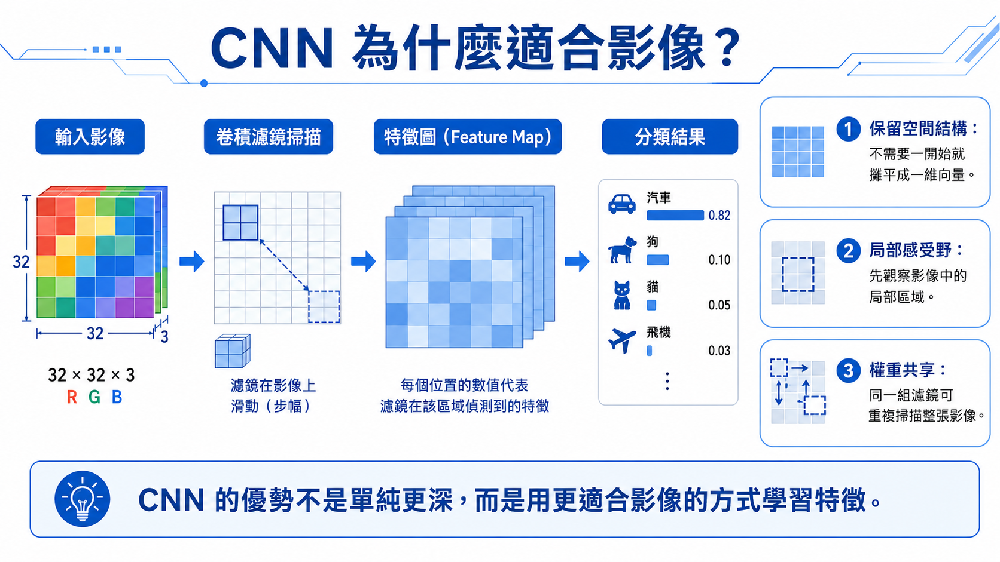

# CNN 影像辨識入門

範例程式：[](https://colab.research.google.com/github/andy6804tw/crazyai-dl/blob/main/code/tensorflow/neural-network-intro-hands-on/06_svhn_cnn_tensorflow.ipynb)

Dense DNN 可以處理影像分類，但它會把圖片攤平成一維向量，讓模型失去像素之間的空間關係。CNN（Convolutional Neural Network，卷積神經網路）則是專門為影像資料設計的神經網路架構。



## 1. 為什麼 CNN 適合影像？

影像中的重要資訊通常不是單一像素，而是局部區域中的形狀、邊緣、紋理與顏色變化。例如數字的筆畫、轉角、封閉區域，都需要觀察鄰近像素之間的關係。

CNN 的卷積層可以在圖片上滑動小型濾波器，擷取局部特徵。這讓模型能夠保留圖片的二維空間結構，而不是把所有像素當成彼此獨立的欄位。

## 2. CNN 的核心元件

| 元件 | 說明 |
|---|---|
| `Conv2D` | 使用卷積濾波器擷取局部影像特徵 |
| `MaxPooling2D` | 壓縮空間尺寸，保留重要特徵 |
| `Flatten` | 將卷積後的特徵圖攤平成向量 |
| `Dense` | 根據抽出的特徵進行分類 |
| `Dropout` | 隨機關閉部分神經元，降低過擬合 |

## 3. 建立 CNN 模型

一個簡單的 CNN 可以寫成：

```py
model = tf.keras.Sequential([
    tf.keras.layers.Input(shape=(32, 32, 3)),
    tf.keras.layers.Rescaling(1./255),
    tf.keras.layers.Conv2D(32, (3, 3), activation='relu', padding='same'),
    tf.keras.layers.MaxPooling2D((2, 2)),
    tf.keras.layers.Conv2D(64, (3, 3), activation='relu', padding='same'),
    tf.keras.layers.MaxPooling2D((2, 2)),
    tf.keras.layers.Conv2D(128, (3, 3), activation='relu', padding='same'),
    tf.keras.layers.Flatten(),
    tf.keras.layers.Dense(128, activation='relu'),
    tf.keras.layers.Dropout(0.3),
    tf.keras.layers.Dense(10, activation='softmax')
])
```

## 4. 模型結果觀察

目前 notebook 的結果如下：

| 模型 | Train Accuracy | Test Accuracy |
|---|---:|---:|
| SVM RBF raw pixels | 0.6947 | 0.5170 |
| Simple Dense DNN | 0.7476 | 0.6540 |
| Optimized Dense DNN | 0.8501 | 0.6973 |
| Small CNN | 0.9814 | 0.9263 |

CNN 的測試準確率明顯高於 Dense DNN，這說明模型架構與資料型態之間的匹配非常重要。對影像分類來說，能保留空間結構的 CNN 通常比單純 flatten 後接 Dense layer 更有效。

## 5. 從 DNN 到 CNN 的觀念差異

| Dense DNN | CNN |
|---|---|
| 將圖片攤平成一維向量 | 保留圖片的二維空間結構 |
| 每個像素被當作獨立特徵 | 擷取局部區域的影像特徵 |
| 適合表格資料或簡單影像 | 適合影像、視覺辨識任務 |
| 需要更多參數學習空間關係 | 透過卷積共享權重，效率較好 |

## 6. 小結

這一章完成了從 Dense DNN 到 CNN 的轉換。模型表現大幅提升，主要原因不是單純把網路變深，而是模型架構更符合影像資料的特性。

接下來的總結章會把整個學習路線串起來，回顧每一個模型的角色與限制。
