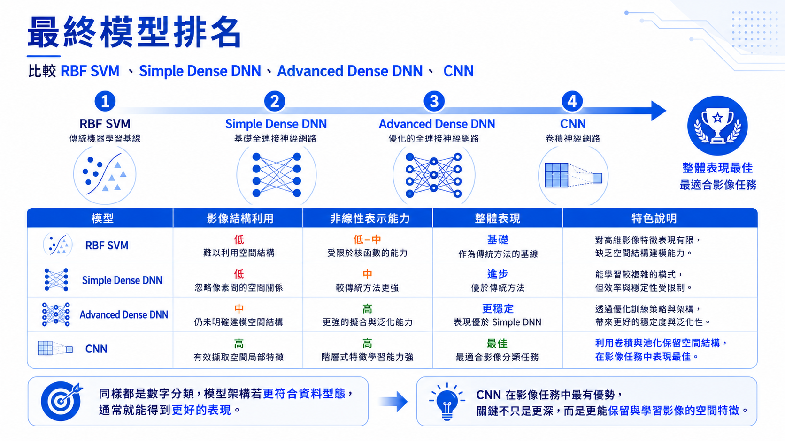

# 模型比較與學習總結

本系列從簡單手寫數字資料開始，逐步走到 SVHN 真實街景數字影像。這樣安排的目的，是讓我們先建立基本機器學習流程，再觀察資料複雜度提高後，不同模型能力的差異。



## 1. 模型結果總覽

| 階段 | 模型 | Train Accuracy | Test Accuracy |
|---|---:|---:|---:|
| 簡單手寫數字 | SVM RBF | 高準確率 | 高準確率 |
| SVHN | SVM RBF raw pixels | 0.6947 | 0.5170 |
| SVHN | Simple Dense DNN | 0.7476 | 0.6540 |
| SVHN | Optimized Dense DNN | 0.8501 | 0.6973 |
| SVHN | Small CNN | 0.9814 | 0.9263 |

!!! note

    簡單手寫數字資料集與 SVHN 是不同資料集，不能直接拿準確率做公平排行。這裡的比較重點是教學脈絡：同樣是數字分類，當資料從乾淨小圖變成真實場景影像時，模型需要更強的表示學習能力。

## 2. 每個模型學到的重點

### 2.1 SVM baseline

SVM 讓我們理解傳統機器學習的基本流程：資料前處理、特徵標準化、模型訓練、模型評估。它在簡單手寫數字資料上表現很好，因此很適合作為入門 baseline。

### 2.2 SVHN SVM

當資料換成 SVHN 後，同樣是數字分類，任務難度明顯提高。SVM 使用 raw pixels 時測試準確率下降，這說明真實影像任務通常需要更好的特徵表示，而不只是更換分類器。

### 2.3 Simple Dense DNN

Dense DNN 能從資料中學習非線性表示，因此比 SVM raw pixels 有明顯改善。不過它仍然把圖片攤平成一維向量，沒有充分利用影像的空間結構。

### 2.4 Optimized Dense DNN

加入 LeakyReLU、learning rate schedule 與 EarlyStopping 後，Dense DNN 表現繼續提升。但 train/test gap 仍提醒我們，單純優化 Dense DNN 仍可能遇到上限。

### 2.5 CNN

CNN 保留影像空間結構，透過卷積擷取局部特徵，因此在 SVHN 上取得最好的測試準確率。這也是 CNN 長期成為影像辨識主流架構的主要原因。

## 3. 本系列的核心觀念

本系列希望建立的不是單一模型技巧，而是一條完整的思考路線：

```text
資料觀察 -> baseline -> 真實資料挑戰 -> DNN -> 優化 -> CNN -> 模型比較
```

在實務專案中，這條路線也很常見。面對一個新問題時，我們通常不會一開始就使用最複雜的模型，而是先建立 baseline，再根據資料特性與錯誤模式逐步改善。

## 4. 學習建議

完成本系列後，可以繼續嘗試：

1. 改變 CNN 層數與 filter 數量。
2. 加入資料增強。
3. 使用 BatchNormalization。
4. 比較不同 optimizer。
5. 嘗試 transfer learning。
6. 使用自己的圖片資料建立分類器。

## 5. 結論

神經網路的重點不只是「模型比較深」，而是能從資料中學到更好的表示方式。對影像任務來說，CNN 的優勢來自於它能保留圖片的空間結構，並從局部區域中抽取有意義的特徵。

從 SVM 到 DNN，再到 CNN，我們看到的是同一個任務在不同資料複雜度與模型能力下的變化。這也是學習深度學習時最重要的核心觀念之一。
